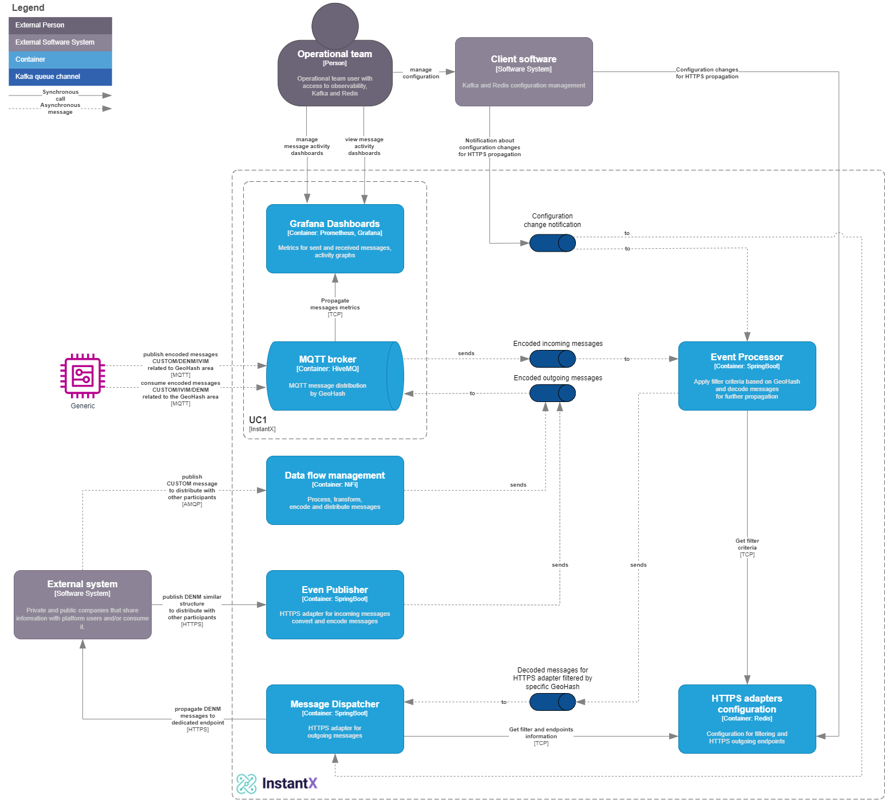

### Table of Contents

- [Introduction](#introduction)
- [Business Context](#business-context)
  - [Use Cases](#use-cases)
- [Architecture](#architecture)
  - [Roadmap](#roadmap)
  - [Target Architecture](#target-architecture)
- [Additional information](#additional-information)
- [Releases](#releases)
- [Contributing](#contributing)
- [Support](#support)
- [References](#references)
- [Licenses](#licenses)

## Introduction

[Instant eXchange] Initially seeded by Vodafone Business in the initiative [STEP], aims to provide an edge cloud platform to exchange and distribute data in real-time between users in a certain geography. One use case is [V2X] (*Vehicle to Anything* communication), where data between road users (e.g. cars), or between road users and road infrastructure (e.g. traffic lights) is anonymously exchanged with each other. Data is shared asynchronously using a publish/subscribe communication pattern, where each message is attached to a specific location, and the subscribers can define location in which to subscribe to and simultaneously adjust the radius used for a more focused or broader subscription range.

## Business Context

### Use Cases

* **UC1** - Distributing messages (esp. V2X messages) using the GeoHash structure

* **UC2** - Exposing ETSI-ITS data (DENM/IVIM) from road users through APIs

* **UC3** - Ingesting DENM/IVIM data through APIs from external provider

* **UC4** - Providing an Integration framework with AMQP support

  and finally
* **UC5** - Exposing APIs for provisioning and portal integration

## Architecture
[Instant eXchange] uses [MQTT] as a protocol and technology.

### Roadmap

> **Disclaimer:** The current state of the project represents a foundational stage, serving as an initial point of reference. Rest assured, our team is committed to releasing additional components to enhance the project's functionality in the near future

### Target Architecture

## Additional information
- [Deployment QuickStart](deployment/quick-start.md)

- User guides
  - [MQTT Topic Structure](./docs/MQTT-Topic-Structure.md)
  - [V2X Message Standards](./docs/v2x-messages.md)
    - [UPER Encoding](./docs/Encoding.md)

## Releases

Please refer to [Release notes](./RELEASE.md) document for detailed information

## Contributing

- Please take a look at our [Contribution guidelines](CONTRIBUTION.md) to learn how to contribute to the [Project InstantX] project.

## Support

 - Internal
   - [Project Wiki](https://github.com/lf-edge/instantx/wiki)
   - [Project Issues](https://github.com/lf-edge/instantx/issues)
 - External
   - [Stackoverflow](http://stackoverflow.com/questions/tagged/InstantX)
   - [Q&A forum](https://groups.google.com/forum/#!forum/InstantX)

## References

- [Project STEP]
  - [Demo SDK iOS]
  - [Demo SDK Android]
- [LF Edge]
  - [LF Edge Wiki]
- [ETSI Standards]

## Licenses

This project is released under [Apache 2.0 License](./LICENSE).

[V2X]: https://en.wikipedia.org/wiki/Vehicle-to-everything
[MQTT]: https://mqtt.org/
[LF Edge]: https://www.lfedge.org/
[LF Edge Wiki]: https://wiki.lfedge.org/
[STEP]: https://step.vodafone.com/
[Project STEP]: https://step.vodafone.com/
[ETSI Standards]: https://portal.etsi.org/Services/Centre-for-Testing-Interoperability/Activities/Intelligent-Transport-System/C-ITS-Protocols
[Demo SDK iOS]: https://github.com/Vodafone/HelloV2XWorld-iOS
[Demo SDK Android]: https://github.com/Vodafone/HelloV2XWorld-Android
[InstantX]: https://github.com/lf-edge/instantx
[Instant eXchange]: https://github.com/lf-edge/instantx
[Project InstantX]: https://github.com/lf-edge/instantx