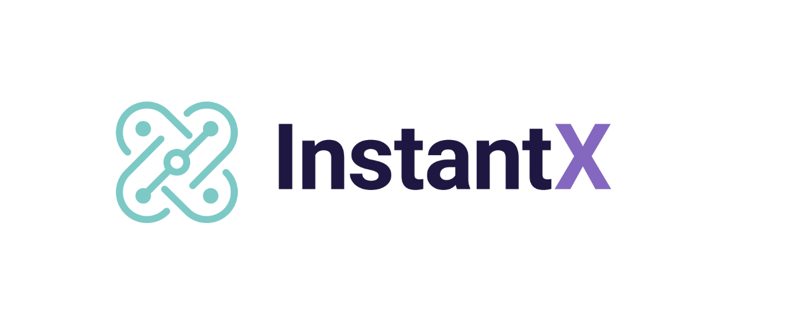
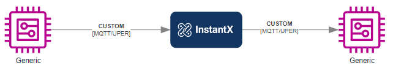
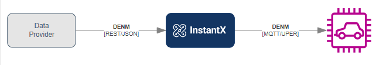
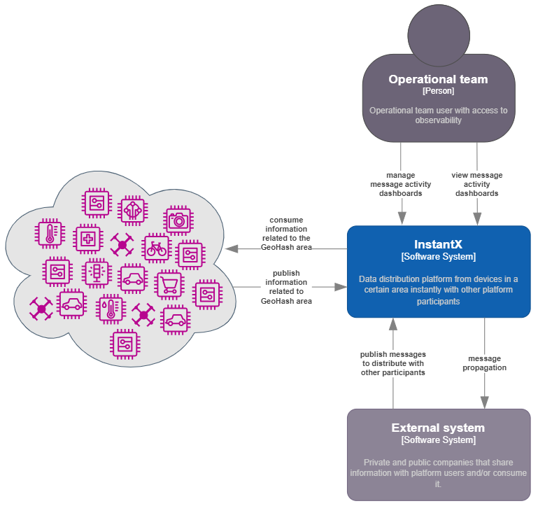
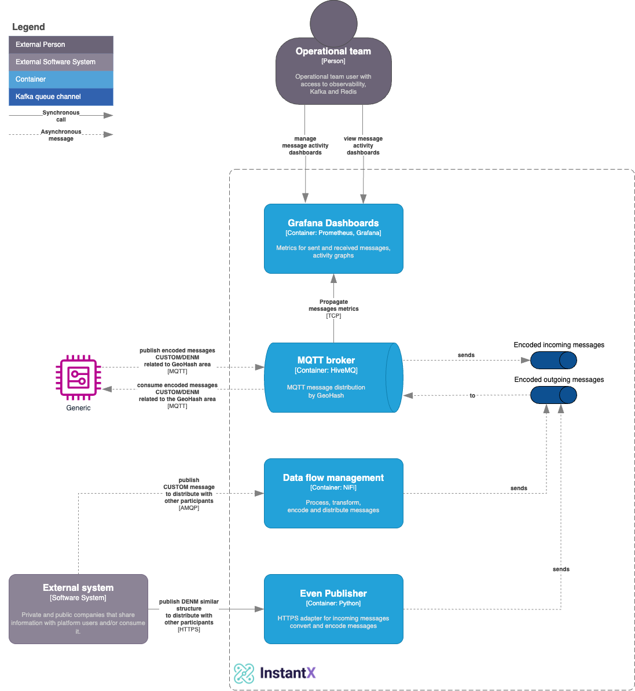

[-5b3bb3?logo=sigstore&logoColor=white)](https://github.com/lf-edge/instantx/blob/main/RELEASE.md#release-process--signature-verification)

### Table of Contents

- [Introduction](#introduction)
- [Business Context](#business-context)
  - [Use Cases](#use-cases)
- [Architecture](#architecture)
  - [System Context Diagram](#system-context-diagram)
  - [Roadmap](#roadmap)
  - [Container Diagram](#container-diagram)
- [Additional information](#additional-information)
- [Releases](#releases)
- [Contributing](#contributing)
- [Support](#support)
- [References](#references)
- [Licenses](#licenses)

## Introduction

Project website: <https://lf-edge.github.io/instantx/>

[InstantX], developed by Vodafone Business within the [STEP] (Safer Transport for Europe Platform) and in collaboration with the [LF Edge], is an edge cloud project designed for real-time data exchange, crucial across various industries including transportation, healthcare, finance, and manufacturing. A key focus of InstantX is [V2X] (Vehicle-to-Everything) communication, which enhances safety and efficiency by facilitating data exchange between road users and infrastructure.

The project employs [Geohash] based publish/subscribe communication pattern for asynchronous data sharing, allowing messages to be associated with specific locations. Subscribers can adjust their location and radius, offering flexibility in data exchange.

## Business Context

[InstantX] addresses the growing demand for real-time data exchange across multiple sectors. Utilizing far-edge computing and MEC architecture principles, it processes and distributes data near the source, improving application responsiveness and efficiency. This is particularly important in transportation, healthcare, finance, and manufacturing, where rapid data exchange is critical for safety, operational efficiency, and productivity.

InstantX is pivotal for [V2X] (Vehicle-to-Everything) communication, enabling the exchange of information among road participants, thereby enhancing connected car applications and road safety. It also facilitates OEM device communications, introducing capabilities like real-time vehicle diagnostics, monitoring, and predictive maintenance. The project's distributed nature ensures secure and reliable services using 5G, edge cloud, and public cloud.

Key features of InstantX include real-time event distribution, brokering, and [V2X] message validation through standard SDKs and APIs. Built as an open ecosystem, it invites contributors to enhance mobility safety, security, and accessibility, while adhering to standards set by [ETSI Standards] and [5GAA] for global interoperability and compliance.

InstantX offers significant benefits:

- **Lower Latency:** Facilitates real-time and high-reliability applications, ideal for IoT, VR, and autonomous vehicles.
- **Streamlined Device Data:** Shifts processing from devices to the edge, enabling sophisticated services on simpler devices.
- **Open Ecosystem**: InstantX is built as an open ecosystem, inviting contributors to enhance edge computing, safety, security, and accessibility.

### Use Cases

- Distributing messages (esp. [V2X] messages) using the GeoHash structure

- Ingesting DENM data through APIs from external provider

- Providing an Integration framework with [AMQP] support

## Architecture

[InstantX] uses [MQTT] as a protocol and technology.

### System Context Diagram

### Roadmap

See **[ROADMAP.md](./ROADMAP.md)** for the project's direction (now / next / later).

> **Disclaimer:** The roadmap is indicative, not a commitment; priorities evolve with community needs and contributions.

### Container Diagram

## Additional information

- [Deployment QuickStart](./deployment/Quick-Start.md)
- [Development guide](./docs/Development.md) — build, test, lint, and static analysis
- [Manual MQTT Testing](./docs/MQTT-Manual-Testing.md) — connect to the broker and validate the publish/subscribe flow with `mosquitto` clients
- [HTTP Integration Testing](./docs/HTTP-Integration-Testing.md) — POST a message to the Event Publisher API and read it back from MQTT

- User guides
  - [MQTT Topic Structure](./docs/MQTT-Topic-Structure.md)
  - [V2X Message Standards](./docs/v2x-messages.md)
    - [UPER Encoding](./docs/Encoding.md)

## Releases

Please refer to [Release notes](./RELEASE.md) document for detailed information

## Contributing

- Please read our [Contributing guidelines](./CONTRIBUTING.md) to learn how to contribute to the [InstantX] project.
- Review our [Code of Conduct](./CODE_OF_CONDUCT.md) and the list of [Maintainers](./MAINTAINERS.md).
- To report a security vulnerability, follow our [Security Policy](./SECURITY.md).

## Support

See [SUPPORT.md](./SUPPORT.md) for all support channels. In short:

- [GitHub Discussions](https://github.com/lf-edge/instantx/discussions) — questions, ideas, and general discussion.
- [GitHub Issues](https://github.com/lf-edge/instantx/issues) — bug reports and feature requests.
- [Project Wiki](https://github.com/lf-edge/instantx/wiki) — community-maintained notes.
- [Stack Overflow](https://stackoverflow.com/questions/tagged/InstantX) — public Q&A (tag `InstantX`).

## References

- [STEP]
  - [Demo SDK iOS]
  - [Demo SDK Android]
- [LF Edge]
  - [LF Edge Wiki]
- [ETSI Standards]

## Licenses

This project is released under [multiple licenses](./LICENSE.md).

[V2X]: https://en.wikipedia.org/wiki/Vehicle-to-everything
[MQTT]: https://mqtt.org/
[AMQP]: https://en.wikipedia.org/wiki/Advanced_Message_Queuing_Protocol
[Geohash]: https://en.wikipedia.org/wiki/Geohash
[LF Edge]: https://www.lfedge.org/
[LF Edge Wiki]: https://wiki.lfedge.org/
[STEP]: https://step.vodafone.com/
[ETSI Standards]: https://portal.etsi.org/Services/Centre-for-Testing-Interoperability/Activities/Intelligent-Transport-System/C-ITS-Protocols
[5GAA]: https://5gaa.org/
[Demo SDK iOS]: https://github.com/Vodafone/HelloV2XWorld-iOS
[Demo SDK Android]: https://github.com/Vodafone/HelloV2XWorld-Android
[InstantX]: https://github.com/lf-edge/instantx
