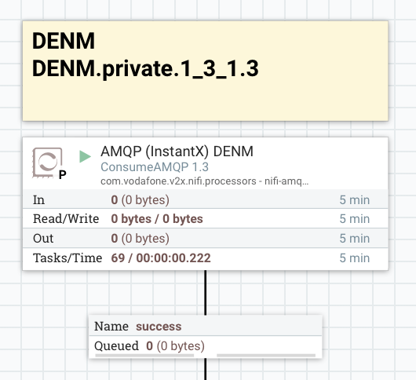
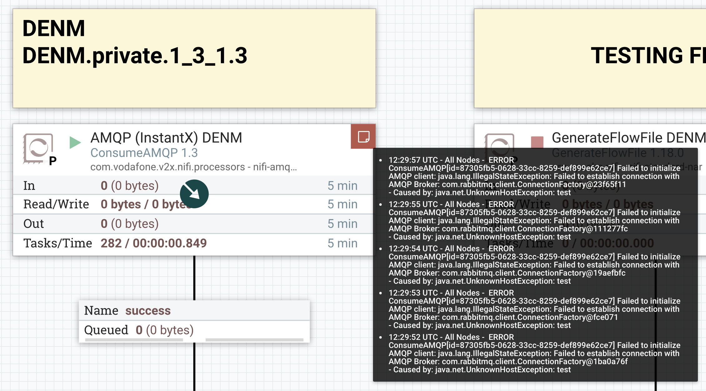

# Connect and test NiFi AMQP Integration

We will use a RabbitMQ instance to act as an external AMQP broker and connect it to our NiFi AMQP Client.

## Step 1: Set Up RabbitMQ with Docker

```bash
# Run a RabbitMQ docker container
docker run -d --name rabbitmq -p 5672:5672 -p 15672:15672 rabbitmq:management

# Connect a RabbitMQ to InstantX Docker network
docker network connect deployment_nifi_network rabbitmq
```

This command will start RabbitMQ with the management plugin enabled, accessible at `http://localhost:15672`. Use the default credentials (`guest`/`guest`) to log in.

## Step 2: Configure RabbitMQ

1. **Access the RabbitMQ Management UI:**
   Open your browser and navigate to `http://localhost:15672`.

2. **Create a Exchange:**
   - Go to the "Exchanges" tab.
   - Go to the "Add a new exchange" section.
   - Enter a name for the queue (e.g., `DENM`).
   - Click "Add exchange".

## Step 3: Configure NiFi to Consume AMQP Messages

1. **Update Parameter Context:**
   - Access to NiFi `http://localhost:8090/nifi/`
   - Click on the burger icon at the top right corner of the window.
   - Click on  `Update Parameter Context`.
   - Click on the `instantx.context` edit button.
   - Set the parameter values as follow:
     - **rabbitmq.server.host.fqdn**: rabbitmq
     - **rabbitmq.server.port.ssl**: 5672
     - **rabbitmq.server.username**: guest
     - **rabbitmq.server.password**: guest

2. **Configure the `AMQP (InstantX) DENM` Processor:**
    - Go to `Integrator_Framework (InstantX) > Interface Layer > Inbound (AMQP) Interface > AMQP (InstantX) DENM`.
    - Right click and click `View configuration`
    - Set the `Exchange Name` parameter to `DENM`

3. **Start the Processor:**
   - Enable the `AMQP (InstantX) DENM` processor by right click and then click `Enable`.
   - Start the `AMQP (InstantX) DENM` processor by right click and then click `Start`.
   - Check if we don't have any error, should be like this.

         NiFi AMQP Processor Working.

   - On the other hand, if we see error icons, you should review the step and confirm the configuration.

         NiFi AMQP Processor Error.

## Step 4: Test the Setup

1. **Publish a Message to RabbitMQ:**
   - Use the RabbitMQ Management UI or a script to publish a message to the test queue.
     - Go to the "Exchanges" tab.
     - Click the test exchange.
     - Set `Routing key` to `DENM.private.1_3_1.3`
     - Enter a following example of DENM message and click "Publish message". (Change the referenceTime date to use valid date e.g. today)

        ```json
         {
            "messageId": "68c36d7b-b2e9-4110-a8f6-8ccc20834af0",
            "customerId": "public",
            "referencePositionLat": 309965575,
            "referencePositionLon": 286933636,
            "disseminationAreaType": 0,
            "disseminationAreaLat": 309965575,
            "disseminationAreaLon": 286933636,
            "disseminationAreaDistA": 1500,
            "disseminationAreaDistB": 0,
            "disseminationAreaAngle": 0,
            "referenceTime": "2025-04-23T19:23:01.000576Z",
            "actionIdStationId": 166163,
            "actionIdSequenceNumber": 1,
            "validityDuration": 60000,
            "denm": "<DENM><header><protocolVersion>2</protocolVersion><messageID>1</messageID><stationID>123456</stationID></header><denm><management><actionID><originatingStationID>123456</originatingStationID><sequenceNumber>1</sequenceNumber></actionID><detectionTime>649940045094</detectionTime><referenceTime>649940045094</referenceTime><eventPosition><latitude>367225309</latitude><longitude>-43965883</longitude><positionConfidenceEllipse><semiMajorConfidence>4095</semiMajorConfidence><semiMinorConfidence>4095</semiMinorConfidence><semiMajorOrientation>3601</semiMajorOrientation></positionConfidenceEllipse><altitude><altitudeValue>0</altitudeValue><altitudeConfidence>alt-000-02</altitudeConfidence></altitude></eventPosition><relevanceDistance>lessThan500m</relevanceDistance><relevanceTrafficDirection>allTrafficDirections</relevanceTrafficDirection><validityDuration>60</validityDuration><transmissionInterval>500</transmissionInterval><stationType>10</stationType></management><situation><informationQuality>0</informationQuality><eventType><causeCode>95</causeCode><subCauseCode>0</subCauseCode></eventType><linkedCause><causeCode>14</causeCode><subCauseCode>0</subCauseCode></linkedCause><eventHistory><EventPoint><eventPosition><deltaLatitude>0</deltaLatitude><deltaLongitude>20</deltaLongitude><deltaAltitude>0</deltaAltitude></eventPosition><eventDeltaTime>1706733817</eventDeltaTime><informationQuality>1</informationQuality></EventPoint><EventPoint><eventPosition><deltaLatitude>897</deltaLatitude><deltaLongitude>10</deltaLongitude><deltaAltitude>-123</deltaAltitude></eventPosition><informationQuality>2</informationQuality></EventPoint></eventHistory></situation><location><eventSpeed><speedValue>1300</speedValue><speedConfidence>127</speedConfidence></eventSpeed><eventPositionHeading><headingValue>0</headingValue><headingConfidence>127</headingConfidence></eventPositionHeading><traces><PathHistory><PathPoint><pathPosition><deltaLatitude>0</deltaLatitude><deltaLongitude>0</deltaLongitude><deltaAltitude>12800</deltaAltitude></pathPosition><pathDeltaTime>1706733917</pathDeltaTime></PathPoint><PathPoint><pathPosition><deltaLatitude>-123</deltaLatitude><deltaLongitude>987</deltaLongitude><deltaAltitude>20</deltaAltitude></pathPosition></PathPoint></PathHistory></traces></location></denm></DENM>"
            }
        ```

2. **Verify Message Consumption in NiFi:**
   - Check the NiFi UI to ensure that the `AMQP (InstantX) DENM` processor is consuming messages from RabbitMQ and processing them as expected.

## Conclusion

You have successfully set up and tested AMQP communication between NiFi and RabbitMQ using Docker. This setup allows you to consume messages from RabbitMQ and process them within NiFi.

For more detailed configurations and advanced settings, refer to the [NiFi documentation](https://nifi.apache.org/docs/nifi-docs/components/org.apache.nifi/nifi-amqp-nar/1.8.0/org.apache.nifi.amqp.processors.ConsumeAMQP/index.html) and [RabbitMQ documentation](https://www.rabbitmq.com/tutorials/amqp-concepts).

## Clean up test environment

```bash
# Stop and Remove the RabbitMQ docker container
docker stop rabbitmq
docker rm rabbitmq
```
