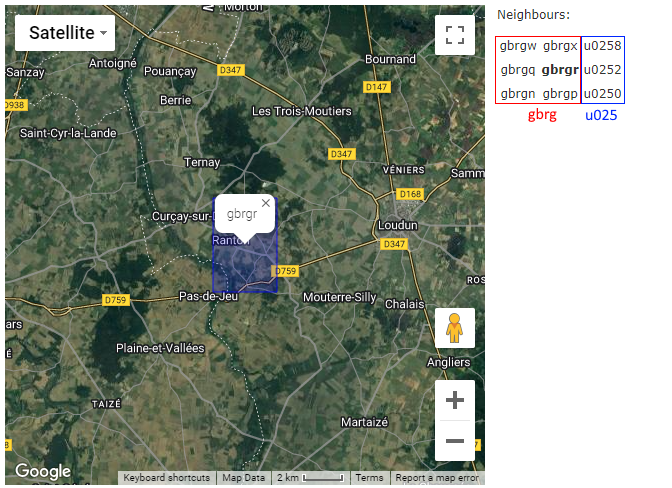
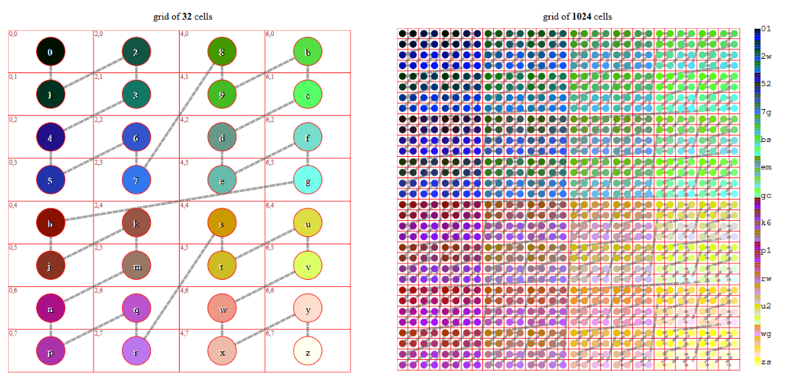

[Home](../README.md) > MQTT Topic Structure

# Using Geohash-based structures

Geohashes encode geographic coordinates into a string of characters, enabling the representation of locations at varying levels of granularity.

## Geohash Levels

Geohash is a public domain geocode system invented in 2008 by Gustavo Niemeyer which encodes a geographic location into a short string of letters and digits. It is a hierarchical spatial data structure which subdivides space into buckets of grid shape.

Geohashes offer properties like arbitrary precision and the possibility of gradually removing characters from the end of the code to reduce its size (and gradually lose precision). Geohashing guarantees that the longer a shared prefix between two geohashes is, the spatially closer they are together. The reverse of this is not guaranteed, as two points can be very close but have a short or no shared prefix.

The "Geohash alphabet" (32ghs) uses all digits 0-9 and all lower case letters except "a", "i", "l" and "o".

### Geohash Precision

|Geohash length | Cell width | Cell height |
| -- | -- | -- |
| 1	| ≤ 5,000km	× |	5,000km |
| 2	| ≤ 1,250km	× |	625km |
| 3	| ≤ 156km	× |	156km |
| 4	| ≤ 39.1km	× | 19.5km |
| 5	| ≤ 4.89km	× |	4.89km |
| 6	| ≤ 1.22km	× |	0.61km |
| 7	| ≤ 153m	× |	153m |
| 8	| ≤ 38.2m	× |	19.1m |
| 9	| ≤ 4.77m	× |	4.77m |
| 10 | ≤ 1.19m	× |	0.596m |
| 11 | ≤ 149mm	× |	149mm |
| 12 | ≤ 37.2mm	× |	18.6mm |

| Geohash Length | Lat. bits | Lng. bits | Lat. error | Lng. error | Km error |
| -- | -- | -- | -- | -- | -- |
| 1 | 2 | 3 | ±23 | ±23 | ±2,500 km (1,600 mi) |
| 2 | 5 | 5 | ±2.8 | ±5.6 | ±630 km (390 mi) |
| 3 | 7 | 8 | ±0.70 | ±0.70 | ±78 km (48 mi) |
| 4 | 10 | 10 | ±0.087 | ±0.18 | ±20 km (12 mi) |
| 5 | 12 | 13 | ±0.022 | ±0.022 | ±2.4 km (1.5 mi; 2,400 m) |
| 6 | 15 | 15 | ±0.0027 | ±0.0055 | ±0.61 km (0.38 mi; 610 m) |
| 7 | 17 | 18 | ±0.00068 | ±0.00068 | ±0.076 km (0.047 mi; 76 m) |
| 8 | 20 | 20 | ±0.000085 | ±0.00017 | ±0.019 km (0.012 mi; 19 m) |
