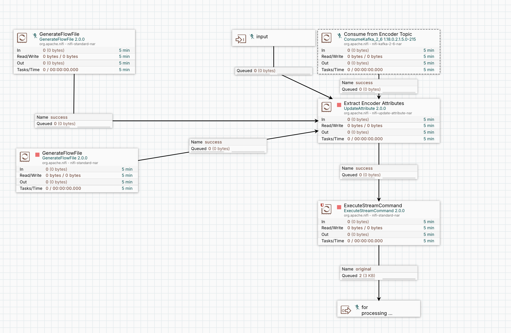
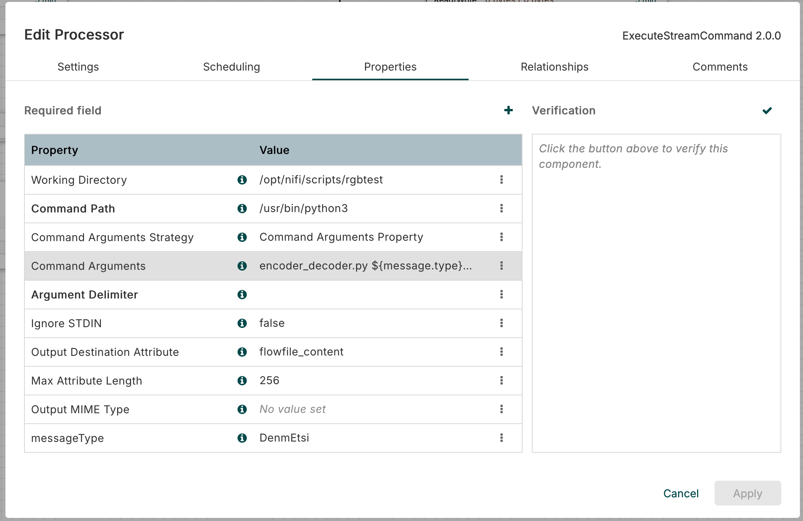
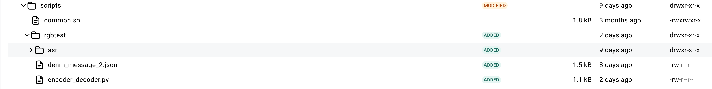
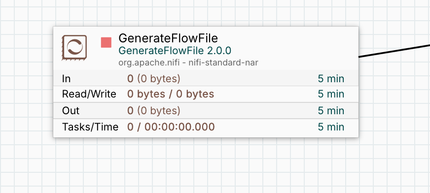

# How to use Apache Nifi ExecuteStreamCommand Processor

The ExecuteStreamCommand processor in Apache NiFi allows you to execute external commands, scripts, or programs. This guide explains how to use the processor with Python scripts, shell scripts, and JavaScript.

## 1. Overview of ExecuteStreamCommand

The ExecuteStreamCommand processor executes an external command or script and sends the output to the output stream. It can be used to integrate NiFi with external programs, scripts, or utilities.
Key Features:

- Execute external commands or scripts.
- Pass flowfile content as input to the command.
- Capture command output and send it to the output stream.
- Supports Python, shell scripts, JavaScript, and other scripting languages.

## 2. Prerequisites

Before using the ExecuteStreamCommand processor, ensure the following:

- Apache NiFi is installed and running.
- The script or command you want to execute is installed and accessible on the NiFi server.
- Required permissions are granted to execute the script or command.

## ##3. Configuring the Processor

Steps to Configure: - Drag and drop the ExecuteStreamCommand processor onto the NiFi canvas.

- Open the processor configuration by double-clicking it.
- Configure the following properties:
  - Command Path: The path to the script or command (e.g., /usr/bin/python3, /bin/bash).
  - Command Arguments: Arguments to pass to the script or command.
  - Working Directory: The directory where the command will execute.
  - Environment Variables: Any environment variables required by the script.
  - Stream Output to Attribute: If enabled, the output will be stored in a flowfile attribute.
  - Stream Output to Content: If enabled, the output will replace the flowfile content.
  - Ignore STDIN: If enabled, the processor will not pass flowfile content to the command.

## 4. Using Python Scripts

Example: Execute a Python Script
Create a Python script (e.g., process_data.py):

```python
  import sys
  input_data = sys.stdin.read()
  processed_data = input_data.upper()  # Example: Convert input to uppercase
  print(processed_data)
```

Configure the ExecuteStreamCommand processor:

- Command Path: /usr/bin/python3
- Command Arguments: /path/to/process_data.py
- Stream Output to Content: true
  Connect the processor to a flow and test it.

## How we added ExecuteStreamCommand to add AMQP processor



The screenshot demonstrates how we streamlined the process by replacing multiple processors with a single ExecuteStreamCommand processor. This processor executes a Python script designed to encode a DenmEtsi message, significantly simplifying the workflow.
As outlined in the ExecuteStreamCommand configuration guide, the screenshot below illustrates the specific settings used to achieve this integration. It provides a visual representation of how the processor is configured to run the Python script effectively.



The screenshot below illustrate the required files and folder for python script.


to test the encoding script we added GenerateFlowFile processor which provide us the Denm Message.


#### DenmEtsi Message as JSON

```json
{
  "gbcGacHeader": {
    "basicHeader": {
      "version": 1,
      "nextHeader": 1,
      "reserved": 0,
      "lifeTime": { "multiplier": 19, "base": 0 },
      "remaingHop": 1
    },
    "commonHeader": {
      "nextHeader": 2,
      "reserved1": 0,
      "headerType": 4,
      "headerSubType": 0,
      "traficClass": { "scf": false, "channelOffload": false, "tcID": 0 },
      "flags": { "mobile": true, "reserved": 0 },
      "payloadLength": 60,
      "maxHopLimit": 1,
      "reserved2": 0
    },
    "sequenceNumber": 1,
    "reserved1": 0,
    "sopv": {
      "address": {
        "configuration": "manual",
        "stationType": 5,
        "reserved": 0,
        "mid": { "lsb": 18, "msb": 3430008 }
      },
      "tst": 1399986296,
      "latitude": -1780258339,
      "longitude": 2103517765,
      "pai": false,
      "speed": -16383,
      "heading": 0
    },
    "geoArea": {
      "lat": -1780258339,
      "long": 2103517765,
      "distanceA": 1000,
      "distanceB": 0,
      "angle": 0
    },
    "reserved2": 0
  },
  "btpb": { "destinationPort": 2002, "destinationPortInfo": 0 },
  "denm": {
    "header": { "protocolVersion": 2, "messageID": 1, "stationID": 123456 },
    "denm": {
      "management": {
        "actionID": { "originatingStationID": 123456, "sequenceNumber": 1 },
        "detectionTime": 649940045094,
        "referenceTime": 649940045094,
        "eventPosition": {
          "latitude": 367225309,
          "longitude": -43965883,
          "positionConfidenceEllipse": {
            "semiMajorConfidence": 4095,
            "semiMinorConfidence": 4095,
            "semiMajorOrientation": 3601
          },
          "altitude": {
            "altitudeValue": 0,
            "altitudeConfidence": "unavailable"
          }
        },
        "relevanceDistance": "lessThan500m",
        "validityDuration": 60,
        "stationType": 10
      },
      "situation": {
        "informationQuality": 0,
        "eventType": { "causeCode": 95, "subCauseCode": 0 }
      },
      "location": {
        "eventPositionHeading": { "headingValue": 0, "headingConfidence": 127 },
        "traces": [
          [
            {
              "pathPosition": {
                "deltaLatitude": 2117,
                "deltaLongitude": 5821,
                "deltaAltitude": 0
              }
            }
          ]
        ]
      }
    }
  }
}
```
