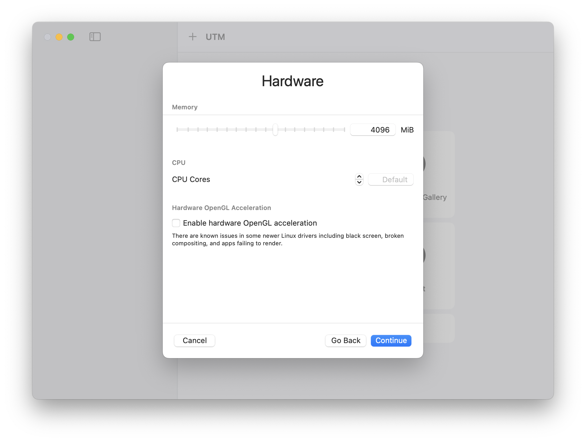
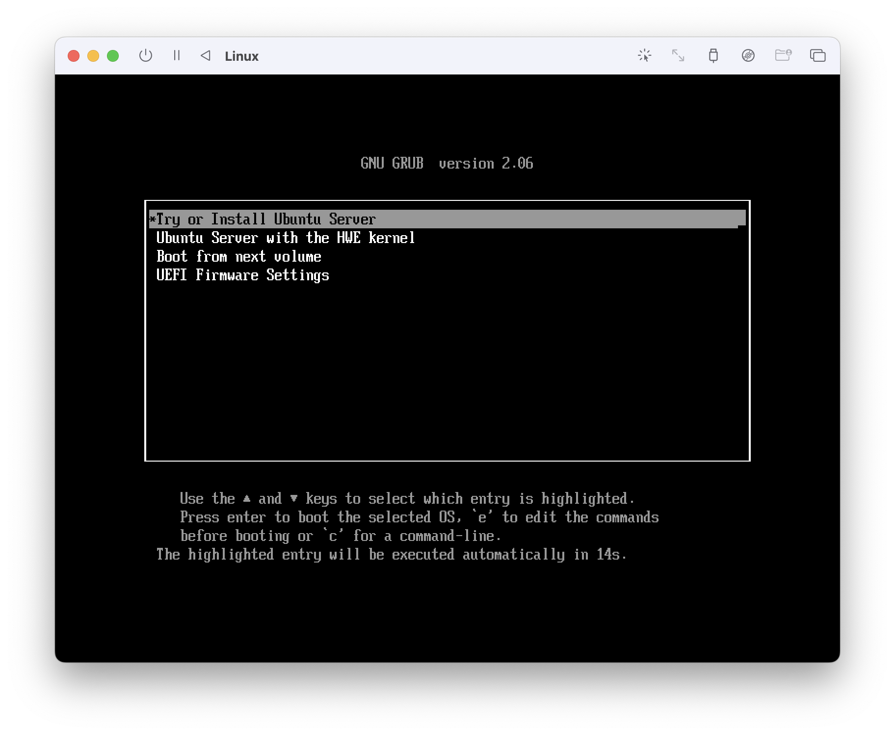

# How to Install Ubuntu 22.04 on an ARM Mac with UTM

## Prerequisites

- An ARM-based Mac
- UTM installed on your Mac
- Ubuntu 22.04 ARM64 image

## Steps screenshots

1. Download UTM from [https://mac.getutm.app/](https://mac.getutm.app/)
2. Open UTM
   

3. Choose "Virtualize"
   

4. Choose "Linux" as the operating system
   

5. Browse to the Ubuntu 22.04 ARM64 image
   
   

6. Keep the default hardware settings
   
   

7. Share folders between macOS and Ubuntu is optional
   

8. Check summary
   

9. Start the Virtual Machine
   

10. Follow the on-screen instructions to complete the Ubuntu installation.
    
    
    
    
    
    
    
    
    
    
    
    
    
    
    

11. Eject the Ubuntu installation media and restart the virtual machine
    
    
    

12. Follow the on-screen instructions to complete the Ubuntu Desktop installation and other configurations.
    
    
    
    
    
    
    

Now the installation is complete, and you can start using Ubuntu 22.04 on your ARM Mac.
