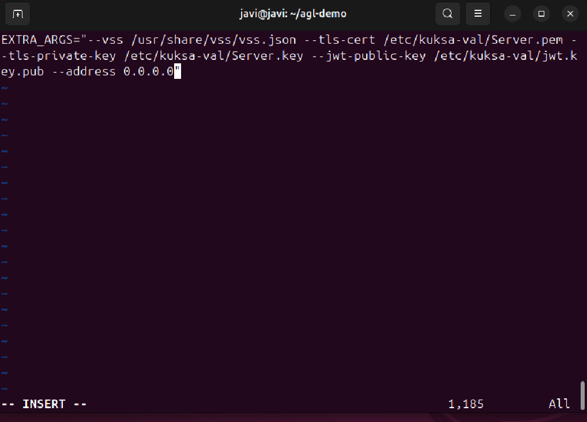
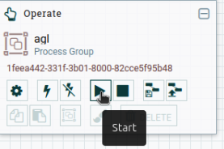

# Step-by-Step Guide: AGL Environment in QEMU with instantX Integration

## Install the Linux Operating System (arm64 with UTM)

- Install a Linux distribution (arm64) using UTM on your Mac.
- Follow the UTM assistant to create and set up the virtual machine. is documented in the [How to Install Ubuntu 22.04 on an ARM Mac with UTM](./how-to-install-ubuntu-22-04-on-an-arm-mac-with-utm.md).

## Install the AGL Image Following the Official Guide

- Go to the “Using ready made images” section in the AGL documentation.
 <https://docs.automotivelinux.org/en/salmon/#01_Getting_Started/01_Quickstart/01_Using_Ready_Made_Images/#1-qemu-emulation_2>
- Download the required files.
- Install QEMU and VNC Viewer (instead of Vinagre).

    ```sh
    mkdir ~/agl-demo/
    cp ~/Downloads/agl-ivi-demo-qt-qemuarm64.ext4.xz ~/agl-demo/
    cp ~/Downloads/Image ~/agl-demo/
    cd ~/agl-demo
    sync
    xz -v -d agl-ivi-demo-qt-qemuarm64.ext4.xz
    sudo apt install qemu-system
    ```

- To run the QEMU image and open port 55555, use the following command (hostfwd=tcp::55555-:55555):

    ```sh
    qemu-system-aarch64 -cpu cortex-a57 -machine virt -nographic \
    -net nic,model=virtio,macaddr=52:54:00:12:34:58 \
    -net user,hostfwd=tcp::55555-:55555 -m 2048 -monitor none -smp 2 -device usb-ehci \
    -device virtio-rng-pci -device VGA,vgamem_mb=64,edid=on \
    -device qemu-xhci -device usb-tablet -device usb-kbd -vnc :0 \
    -kernel Image -append "console=ttyAMA0,115200 root=/dev/vda verbose systemd.log_color=false " \
    -drive format=raw,file=agl-ivi-demo-qt-qemuarm64.ext4 \
    -snapshot
    ```

## Initial Configuration in the AGL Image

- Log in as `root`.
- Use `screen` to manage multiple terminal windows:
  - `Ctrl + a`, then `c`: Create a new window.
  - `Ctrl + a`, then `n`: Switch to the next window.
- Go to `/etc/default` and edit the configuration `kuksa-databroker` and add at the end of the command `--address 0.0.0.0`

    ```sh
    cd /etc/default
    vim kuksa-databroker
    ```

    

- Restart the kuksa-databroker service:

    ```sh
    systemctl restart kuksa-databroker
    ```

## Running Essential Services in AGL

- In one `screen` window, start the Kuksa client:

    ```sh
    kuksa-client grpcs://localhost:55555 --cacertificate /etc/kuksa-val/CA.pem --tls-server-name localhost
    ```

    

- To authenticate in Kuksa:

    ```sh
    authorize /etc/kuksa-can-provider/can-provider.token
    ```

- To check the vehicle speed:

    ```sh
    getValue Vehicle.Speed
    ```

- In another window ( with `Ctrl + a`, then `c`), start the CAN simulator:

    ```sh
    python3 /usr/sbin/simple_can_simulator.py can0
    ```

    

## Install and Configure agl-vss-proxy

- Clone the repository:

    ```sh
    cd ~/agl-demo
    sudo apt install git
    git clone <https://git.automotivelinux.org/src/agl-vss-proxy>
    ```

- Install required dependencies:

    ```sh
    sudo apt install g++ protobuf-compiler libprotobuf-dev libgrpc++-dev \
    libglib2.0-dev libssl-dev libmosquitto-dev libyaml-cpp-dev meson ninja-build git
    ```

- Clone the kuksa-databroker repository for protobuf definitions:

    ```sh
    cd ~/agl-demo
    git clone <https://github.com/eclipse-kuksa/kuksa-databroker>
    ```

- Install grpc_cpp_plugin:

    ```sh
    sudo apt install protobuf-compiler-grpc
    ```

- Install libsystemd:

    ```sh
    sudo apt-get install --reinstall libsystemd-dev
    ```

- Modify `meson.build` file, adding the dependency `libsystemd` instead of `systemd`:

    ```sh
    cd ~/agl-demo/agl-vss-proxy/systemd
    ```

    ```sh
    sudo nano meson.build
    ```

- Build agl-vss-proxy (adjust the proto path as needed):

    ```sh
    cd ~/agl-demo/agl-vss-proxy
    sudo apt install cmake
    meson -Dprotos=$HOME/agl-demo/kuksa-databroker/proto build
    cd build
    ninja
    ```

- Create the configuration file `/etc/agl-vss-proxy/config.yaml`:

    ```sh
    sudo mkdir -p /etc/agl-vss-proxy && sudo tee /etc/agl-vss-proxy/config.yaml > /dev/null <<EOF
        kuksa:
        hostname: localhost
        port: 55555
        authorization: /home/javi/agl-demo/agl-vss-proxy.token
        use-tls: true
        ca-certificate: /home/javi/agl-demo/CA.pem

        mqtt:
        hostname: 127.0.0.1
        port: 1883
        topic: vss/Vehicle/Speed
        qos: 1
        retain: false

        signals:
        - signal: Vehicle.Speed
        EOF
    ```

- Create the `CA.pem` certificate and the token in the specified path:

    ```sh
    cd ~/agl-demo/
    echo "-----BEGIN CERTIFICATE-----
    MIID3zCCAscCFDixxnLKOE9pr9sDQynjRqX7u+TlMA0GCSqGSIb3DQEBCwUAMIGr
    MQswCQYDVQQGEwJVUzEWMBQGA1UECAwNU2FuIEZyYW5jaXNjbzETMBEGA1UEBwwK
    Q2FsaWZvcm5pYTEcMBoGA1UECgwTYXV0b21vdGl2ZWxpbnV4Lm9yZzEVMBMGA1UE
    AwwMbG9jYWxob3N0LWNhMTowOAYJKoZIhvcNAQkBFithZ2wtZGV2LWNvbW11bml0
    eUBsaXN0cy5hdXRvbW90aXZlbGludXgub3JnMB4XDTIzMDcyMDIwMzg1NVoXDTMz
    MDcxNzIwMzg1NVowgasxCzAJBgNVBAYTAlVTMRYwFAYDVQQIDA1TYW4gRnJhbmNp
    c2NvMRMwEQYDVQQHDApDYWxpZm9ybmlhMRwwGgYDVQQKDBNhdXRvbW90aXZlbGlu
    dXgub3JnMRUwEwYDVQQDDAxsb2NhbGhvc3QtY2ExOjA4BgkqhkiG9w0BCQEWK2Fn
    bC1kZXYtY29tbXVuaXR5QGxpc3RzLmF1dG9tb3RpdmVsaW51eC5vcmcwggEiMA0G
    CSqGSIb3DQEBAQUAA4IBDwAwggEKAoIBAQDDJZvopAg03G1TuyukI2QdVTzHQxnG
    iPePMVIBAQ8M5tBWBOZxxkOgwRBTqZ1GJRvgPPediPHb3+/j+k5/+NE8TT2smDfk
    4u9+NBNFXGhC9jqoEe0nkxca85RHP1Jx1iIp8SJ1TTtzEu4q/O/9bCnA+05NPLWQ
    YbDZr++lR4Bwhpz0ZVD69uZE/7aXPKVoVQPyeiwNgP7sfn5XOx+THpYz2Lwl2ew/
    490Mm5Wrw5pQkq49s5On5tR7cdms3CWnVKe+qpeJo/ShZg8mJesMusZRLZ3slSPp
    GMVBbdFPhIv0L4HFzoJcnEzo1j6+h7fhu4v5T2qNkCkBlxehqvsy3DwfAgMBAAEw
    DQYJKoZIhvcNAQELBQADggEBALNHiz8a86sZv6Pii/rtrlctD2x1qIobOAjQID55
    /ylAVPc0JuzGEpc8Hcl9jQXBFz2ZBBYTEn0iAB+nn9BnxWYpF/G9LQsz61uzdJJs
    0WlR3FyjN8PwCysMwzGEmG2BH43vfg9oltAKxY4rZ3l5c8eL/a9o2vDzNjKNibll
    NdLB+8NkZz33pjyru1sG2lw6Y1gxhcOMSU7MuHgW1YI06slBu56e92OQt5atRc6l
    rY9faELSJpLhtKYF9spsS/LsITJrKdVkMZRgqrhoWAIB9qyehtBGk+Agk8MvBba8
    nRAF332SyeLeN/ytJTbjOmcYVh9daGADdyRb5d+5ALBuutU=
    -----END CERTIFICATE-----" > CA.pem
    ```

    ```sh
    wget <https://git.automotivelinux.org/AGL/meta-agl-demo/plain/recipes-connectivity/agl-vss-proxy/agl-vss-proxy/agl-vss-proxy.token>
    ```

- Run agl-vss-proxy:

    ```sh
    cd ~/agl-demo/agl-vss-proxy/build/src/
    ./agl-vss-proxy
    ```

    

## Integration with instantX

Below are the new steps to integrate instantX into your setup. Do not modify previous steps; simply add these to your existing guide.

- Clone the instantX Repository from Github

    ```sh
    cd ~/agl-demo/
    git clone https://github.com/lf-edge/instantx.git
    ```

- Install Docker

    ```sh
    sudo apt-get update
    sudo apt-get upgrade
    sudo apt install curl
    curl -fsSL test.docker.com -o get-docker.sh && sh get-docker.sh
    ```

- Install QEMU for emulation in Docker

    ```sh
    sudo apt install qemu-user-static binfmt-support
    ```

- Start the Docker Environment

    ```sh
    cd ~/instantx-platform/deployment
    sudo docker compose up -d
    ```

- Set Up and Start the NiFi Flow

    Open your browser and access NiFi at: <http://localhost:8090/nifi>

    Locate and start the AGL flow within the NiFi interface.

    

- Access Grafana Dashboards

    Open Grafana in your browser at: <http://localhost:3000>

    Log in with:
      Username: admin
      Password: admin

    Go to Manage Dashboards and select the AGL - InstantX dashboard to visualize data.

    
